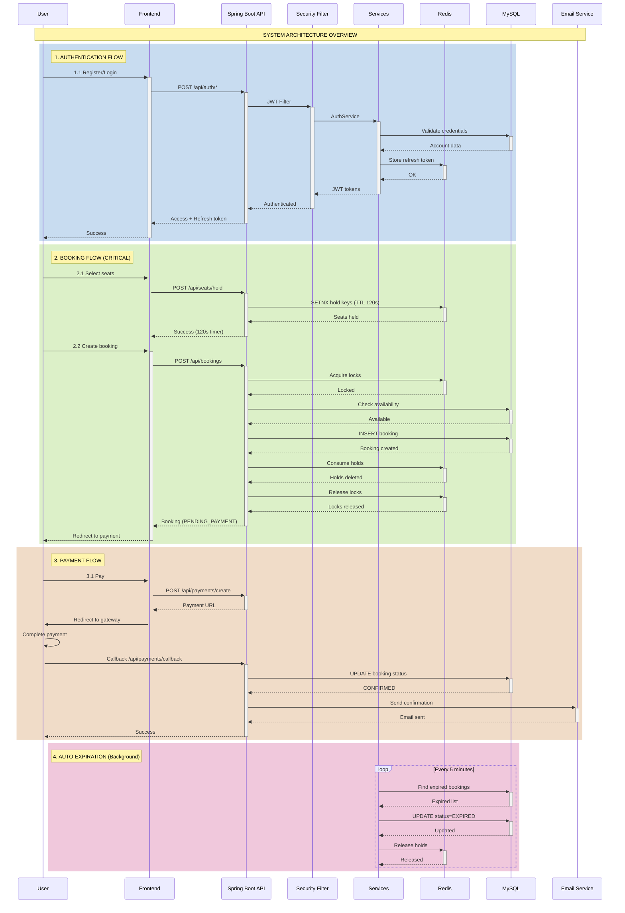
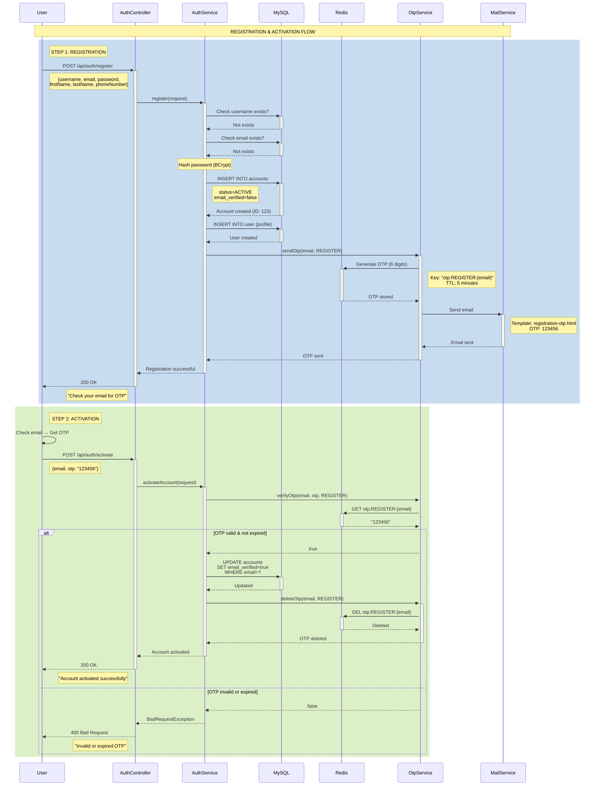
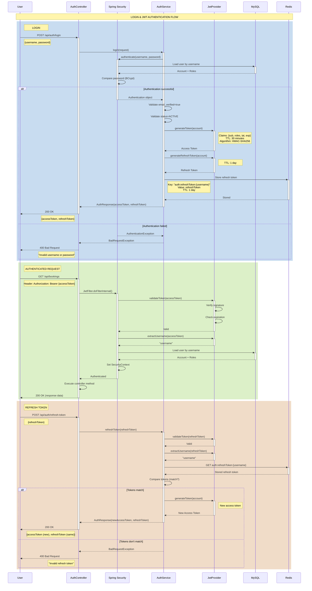
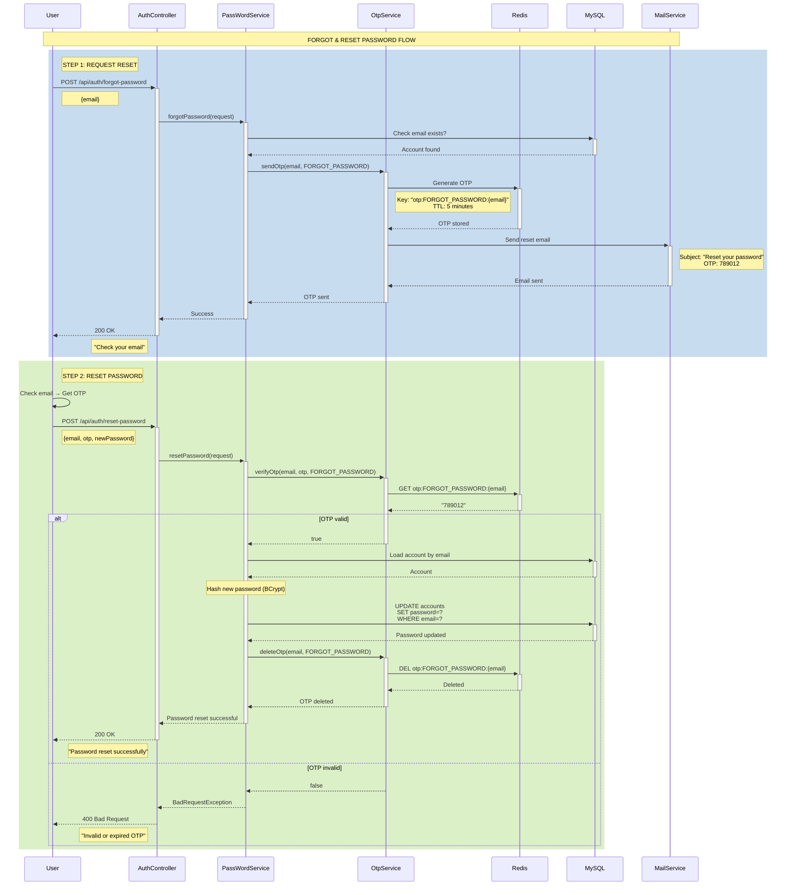
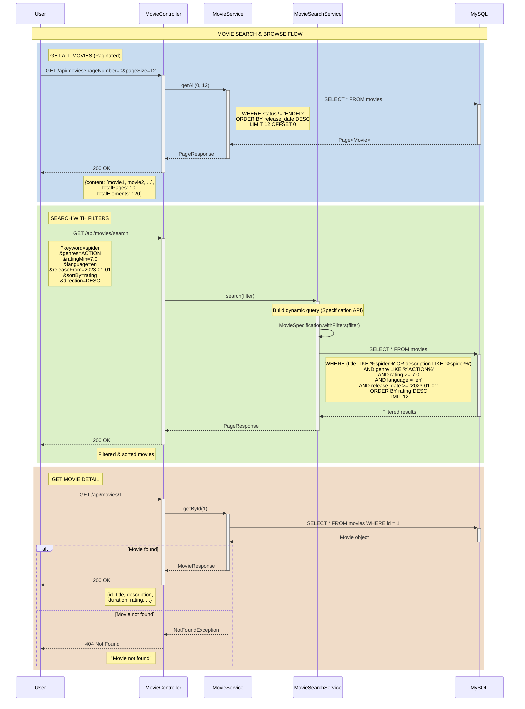

# 📊 Sequence Diagrams - Movie Booking System

> Biểu đồ tuần tự (Sequence Diagrams) cho tất cả các flows trong hệ thống

## 📋 Danh sách Diagrams

1. [System Overview Diagram](#1-system-overview-diagram)
2. [Registration & Activation Flow](#2-registration--activation-flow)
3. [Login & JWT Authentication Flow](#3-login--jwt-authentication-flow)
4. [Forgot & Reset Password Flow](#4-forgot--reset-password-flow)
5. [Booking Flow - Complete (CRITICAL)](#5-booking-flow---complete-critical)
6. [Payment Flow](#6-payment-flow)
7. [Auto Booking Expiration](#7-auto-booking-expiration)
8. [Movie Search & Browse](#8-movie-search--browse)

---

## 1. System Overview Diagram

### Tổng quan kiến trúc và luồng chính



---

## 2. Registration & Activation Flow



---

## 3. Login & JWT Authentication Flow



---

## 4. Forgot & Reset Password Flow



---

## 5. Booking Flow - Complete (CRITICAL)

### 🎯 Flow phức tạp nhất - Xử lý concurrent booking

```mermaid
sequenceDiagram
    participant U as User
    participant API as Controllers
    participant SVC as BookingService
    participant SEAT as SeatDomainService
    participant LOCK as RedisLockService
    participant REDIS as Redis
    participant DB as MySQL

    Note over U,DB: COMPLETE BOOKING FLOW WITH CONCURRENCY CONTROL

    rect rgb(200, 220, 240)
    Note right of U: STEP 1: HOLD SEATS
    U->>+API: POST /api/seats/hold
    Note right of U: {showtimeId: 10,<br/>seatIds: [1,2,3],<br/>ttlSec: 120}
    
    API->>+DB: Validate showtime exists
    DB-->>-API: Showtime OK
    
    API->>+DB: Validate seats exist
    DB-->>-API: Seats OK
    
    API->>+SEAT: holdSeats(showtimeId, seatIds, userId, 120s)
    
    loop For each seatId in [1,2,3]
        SEAT->>+REDIS: SETNX hold:10:1 = userId
        Note right of SEAT: TTL: 120 seconds
        
        alt Seat not held
            REDIS-->>SEAT: Success (key created)
            Note left of REDIS: Seat locked
            
        else Seat already held
            REDIS-->>SEAT: Fail (key exists)
            SEAT->>+REDIS: GET hold:10:1
            REDIS-->>-SEAT: currentOwner
            
            alt Same user (idempotent)
                SEAT->>+REDIS: EXPIRE hold:10:1 120
                Note right of SEAT: Refresh TTL
                REDIS-->>-SEAT: TTL refreshed
                
            else Different user
                SEAT-->>API: ConflictException
                API-->>U: 409 Conflict
                Note left of API: "Seat held by another user"
                Note over U,DB: FLOW STOPS
            end
        end
    end
    
    SEAT-->>-API: All seats held
    API-->>-U: 200 OK
    Note left of API: "Seats held for 120 seconds"
    Note over U: User has 120s to create booking
    end

    rect rgb(220, 240, 200)
    Note right of U: STEP 2: CREATE BOOKING
    U->>+API: POST /api/bookings
    Note right of U: {showtimeId: 10,<br/>seatIds: [1,2,3]}
    
    API->>+SVC: create(request)
    
    Note over SVC: 1. Validate input
    SVC->>SVC: Check seatIds not empty
    
    SVC->>+DB: Load showtime
    DB-->>-SVC: Showtime object
    
    Note over SVC: 2. PRE-CHECK: Verify holds
    SVC->>+SEAT: assertHeldByUser(10, [1,2,3], userId)
    
    loop For each seatId
        SEAT->>+REDIS: GET hold:10:1
        REDIS-->>-SEAT: owner
        
        alt Not held or wrong owner
            SEAT-->>SVC: ConflictException
            SVC-->>API: ConflictException
            API-->>U: 409 Conflict
            Note left of API: "Seat not held or expired"
            Note over U,DB: FLOW STOPS
        end
    end
    SEAT-->>-SVC: All seats held by user ✓
    
    Note over SVC: 3. Get seat infos
    SVC->>+SEAT: getSeatInfos([1,2,3])
    SEAT->>+DB: SELECT * FROM seats WHERE id IN (1,2,3)
    DB-->>-SEAT: [Seat(id:1, type:VIP), Seat(id:2, type:STANDARD), ...]
    SEAT-->>-SVC: [SeatInfo(1, VIP), SeatInfo(2, STANDARD), ...]
    
    Note over SVC: 4. ACQUIRE DISTRIBUTED LOCKS
    SVC->>SVC: Sort seatIds: [1,2,3]
    
    loop For each seatId (sorted)
        SVC->>+LOCK: tryLockSeat(10, 1, 30s)
        LOCK->>+REDIS: SETNX lock:10:1 = "locked"
        Note right of LOCK: TTL: 30 seconds
        
        alt Lock acquired
            REDIS-->>-LOCK: Success
            LOCK-->>-SVC: true
            Note over SVC: Lock acquired for seat 1
            
        else Lock failed
            REDIS-->>LOCK: Fail
            LOCK-->>SVC: false
            
            Note over SVC: Release all acquired locks
            SVC->>+LOCK: Release locks [1]
            LOCK->>+REDIS: DEL lock:10:1
            REDIS-->>-LOCK: Deleted
            LOCK-->>-SVC: Locks released
            
            SVC-->>API: ConflictException
            API-->>U: 409 Conflict
            Note left of API: "Cannot lock seat, try again"
            Note over U,DB: FLOW STOPS
        end
    end
    
    Note over SVC: All locks acquired ✓
    
    Note over SVC: 5. RE-VERIFY holds (TOCTOU prevention)
    SVC->>+SEAT: assertHeldByUser(10, [1,2,3], userId)
    SEAT->>REDIS: Verify holds again under lock
    SEAT-->>-SVC: Still held ✓
    
    Note over SVC: 6. @Transactional createBookingTransaction()
    SVC->>+DB: BEGIN TRANSACTION
    
    SVC->>+DB: Check DB: Seats not booked?
    Note right of SVC: SELECT * FROM booking_seats<br/>WHERE showtime_id=10 AND seat_id IN (1,2,3)<br/>AND booking.status IN (PENDING, CONFIRMED)
    
    alt Seats already booked
        DB-->>SVC: Found booked seats [1]
        SVC->>+DB: ROLLBACK
        DB-->>-SVC: Rolled back
        
        Note over SVC: Release locks (finally)
        SVC->>+LOCK: Release locks
        LOCK->>+REDIS: DEL lock:10:1, lock:10:2, lock:10:3
        REDIS-->>-LOCK: Deleted
        LOCK-->>-SVC: Released
        
        SVC-->>API: ConflictException
        API-->>U: 409 Conflict
        Note left of API: "Seat already booked (race condition)"
        Note over U,DB: FLOW STOPS
    else Seats available
        DB-->>-SVC: No conflicts
        
        Note over SVC: Calculate prices
        Note right of SVC: STANDARD: basePrice<br/>VIP: basePrice * 1.3
        SVC->>SVC: totalPrice = sum(prices)
        
        SVC->>+DB: INSERT INTO bookings
        Note right of SVC: (account_id, showtime_id,<br/>total_price, status=PENDING_PAYMENT)
        DB-->>-SVC: Booking created (ID: 100)
        
        SVC->>+DB: INSERT INTO booking_seats
        Note right of SVC: (booking_id:100, seat_id:1, price:195000)<br/>(booking_id:100, seat_id:2, price:150000)<br/>(booking_id:100, seat_id:3, price:150000)
        DB-->>-SVC: BookingSeats created
        
        SVC->>+DB: COMMIT
        DB-->>-SVC: Transaction committed
        
        Note over SVC: 7. CONSUME Redis holds
        SVC->>+SEAT: consumeHoldToBooked(10, [1,2,3])
        
        loop For each seatId
            SEAT->>+REDIS: DEL hold:10:1
            REDIS-->>-SEAT: Deleted
            Note right of SEAT: Hold consumed (booked in DB)
        end
        SEAT-->>-SVC: Holds consumed ✓
        
        Note over SVC: 8. RELEASE locks (finally)
        SVC->>+LOCK: releaseSeatLock(10, 1)
        LOCK->>+REDIS: DEL lock:10:1
        REDIS-->>-LOCK: Deleted
        LOCK-->>-SVC: Lock 1 released
        
        SVC->>+LOCK: releaseSeatLock(10, 2)
        LOCK->>+REDIS: DEL lock:10:2
        REDIS-->>-LOCK: Deleted
        LOCK-->>-SVC: Lock 2 released
        
        SVC->>+LOCK: releaseSeatLock(10, 3)
        LOCK->>+REDIS: DEL lock:10:3
        REDIS-->>-LOCK: Deleted
        LOCK-->>-SVC: Lock 3 released
        
        SVC-->>-API: BookingResponse(id:100, status:PENDING_PAYMENT)
        API-->>-U: 200 OK
        Note left of API: {id: 100, totalPrice: 495000,<br/>status: PENDING_PAYMENT}<br/>"Complete payment within 15 minutes"
    end
    end

    Note over U: User must pay within 15 minutes!
```



### 🔒 Concurrency Control Mechanisms

**1. Redis SETNX (Atomic Hold)**
```
SETNX hold:{showtimeId}:{seatId} {userId} TTL=120s
- Atomic operation
- Only 1 user can hold at a time
- Auto-expire after 120s
```

**2. Distributed Locks (Deadlock Prevention)**
```
Sorted order: [1, 2, 3]
- Always lock in ascending order
- Prevents circular wait (deadlock condition)
- Timeout: 30s per lock
```

**3. TOCTOU Prevention**
```
Time-of-Check, Time-of-Use race:
1. Pre-check holds (before lock)
2. Acquire locks
3. RE-CHECK holds (under lock) ← CRITICAL!
4. Create booking
```

**4. Database Transaction Isolation**
```java
@Transactional(isolation = Isolation.READ_COMMITTED)
- Check seats not booked in DB
- Insert booking + booking_seats
- Commit atomically
```

---

## 6. Payment Flow

```mermaid
sequenceDiagram
    participant U as User
    participant API as PaymentController
    participant SVC as PaymentService
    participant DB as MySQL
    participant SEAT as SeatDomainService
    participant REDIS as Redis
    participant GW as Payment Gateway

    Note over U,GW: PAYMENT FLOW (⚠️ MOCK - Need Integration)

    rect rgb(200, 220, 240)
    Note right of U: STEP 1: CREATE PAYMENT
    U->>+API: POST /api/payments/create/100
    Note right of U: bookingId: 100
    
    API->>+SVC: createPaymentUrl(100)
    
    SVC->>+DB: Load booking
    DB-->>-SVC: Booking(id:100, status:PENDING_PAYMENT, totalPrice:495000)
    
    alt Status != PENDING_PAYMENT
        SVC-->>API: BadRequestException
        API-->>U: 400 Bad Request
        Note left of API: "Booking not in PENDING_PAYMENT status"
        Note over U,GW: FLOW STOPS
    end
    
    Note over SVC: ⚠️ TODO: Generate real payment URL
    Note right of SVC: Should integrate:<br/>- VNPay: vnpayment.vn<br/>- MoMo: momo.vn<br/>- Stripe: stripe.com
    
    Note over SVC: MOCK URL Generation
    SVC->>SVC: mockUrl = "https://mock-gateway.com/checkout?bookingId=100&amount=495000"
    
    SVC-->>-API: paymentUrl
    API-->>-U: 200 OK
    Note left of API: {paymentUrl: "https://mock-gateway.com/..."}
    
    U->>+GW: Redirect to payment gateway
    Note right of U: User fills card info, confirms
    
    GW->>GW: Process payment
    end

    rect rgb(220, 240, 200)
    Note right of GW: STEP 2: PAYMENT CALLBACK
    GW->>+API: POST /api/payments/callback
    Note right of GW: {bookingId: 100,<br/>status: "SUCCESS",<br/>transactionId: "TXN123",<br/>amount: 495000,<br/>signature: "abc..."}
    
    API->>+SVC: handlePaymentCallback(request)
    
    Note over SVC: ⚠️ CRITICAL: Verify signature
    Note right of SVC: TODO: Implement HMAC-SHA512<br/>verification with gateway secret
    
    Note over SVC: ⚠️ Missing implementation:
    Note right of SVC: if (!verifySignature(request)) {<br/>  throw SecurityException;<br/>}
    
    SVC->>+DB: Load booking
    DB-->>-SVC: Booking(id:100)
    
    Note over SVC: ⚠️ TODO: Check idempotency
    Note right of SVC: Check transactionId unique:<br/>if (paymentRepo.existsByTxnId(TXN123)) {<br/>  return "DUPLICATE";<br/>}
    
    Note over SVC: ⚠️ TODO: Validate amount
    Note right of SVC: if (request.amount != booking.totalPrice) {<br/>  throw BadRequestException;<br/>}
    
    alt Payment SUCCESS
        SVC->>+DB: BEGIN TRANSACTION
        
        SVC->>+DB: UPDATE bookings<br/>SET status='CONFIRMED'<br/>WHERE id=100
        DB-->>-SVC: Updated
        
        SVC->>+DB: COMMIT
        DB-->>-SVC: Committed
        
        Note over SVC: Consume Redis holds
        SVC->>+SEAT: consumeHoldToBooked(10, [1,2,3])
        SEAT->>+REDIS: DEL hold:10:1, hold:10:2, hold:10:3
        REDIS-->>-SEAT: Deleted
        SEAT-->>-SVC: Holds consumed
        
        Note over SVC: ⚠️ TODO: Send email
        Note right of SVC: emailService.sendBookingConfirmation(booking)
        
        Note over SVC: ⚠️ TODO: Generate QR code
        Note right of SVC: qrCode = qrService.generate(bookingId)
        
        SVC-->>-API: PaymentResponse(SUCCESS)
        API-->>-GW: 200 OK
        GW-->>-U: Payment successful!
        Note right of U: Show confirmation page
        
    else Payment FAILED
        SVC->>+DB: BEGIN TRANSACTION
        
        SVC->>+DB: UPDATE bookings<br/>SET status='CANCELLED'<br/>WHERE id=100
        DB-->>-SVC: Updated
        
        SVC->>+DB: COMMIT
        DB-->>-SVC: Committed
        
        Note over SVC: Release holds
        SVC->>+SEAT: releaseHolds(10, [1,2,3])
        SEAT->>+REDIS: DEL hold:10:1, hold:10:2, hold:10:3
        REDIS-->>-SEAT: Deleted
        SEAT-->>-SVC: Holds released
        
        SVC-->>API: PaymentResponse(FAILED)
        API-->>GW: 200 OK
        GW-->>U: Payment failed
        Note right of U: Show error, seats released
    end
    end

    rect rgb(240, 220, 200)
    Note right of U: OPTIONAL: Verify Payment
    U->>+API: GET /api/payments/verify/100
    
    API->>+SVC: verifyPaymentStatus(100)
    
    Note over SVC: ⚠️ TODO: Query gateway API
    Note right of SVC: Should call gateway's<br/>transaction query endpoint<br/>to verify actual status
    
    SVC->>+DB: Load booking
    DB-->>-SVC: Booking(status:CONFIRMED)
    
    SVC-->>-API: "CONFIRMED"
    API-->>-U: 200 OK
    Note left of API: {status: "CONFIRMED"}
    end
```

### ⚠️ Critical Security Issues

1. **Signature Verification Missing**
```java
// MUST implement:
boolean verifySignature(PaymentRequest req) {
    String dataToSign = buildSignData(req); // All params except signature
    String calculatedHash = HmacSHA512(secretKey, dataToSign);
    return req.getSignature().equals(calculatedHash);
}
```

2. **Idempotency Check Missing**
```java
// MUST implement:
if (paymentTransactionRepository.existsByTransactionId(req.getTransactionId())) {
    log.warn("Duplicate transaction: {}", req.getTransactionId());
    return buildResponse(booking, "DUPLICATE");
}
```

3. **Amount Validation Missing**
```java
// MUST implement:
BigDecimal receivedAmount = new BigDecimal(req.getAmount());
if (receivedAmount.compareTo(booking.getTotalPrice()) != 0) {
    throw new BadRequestException("Amount mismatch");
}
```

---

## 7. Auto Booking Expiration

```mermaid
sequenceDiagram
    participant CRON as Cron Job
    participant SVC as BookingExpireService
    participant DB as MySQL
    participant SEAT as SeatDomainService
    participant REDIS as Redis

    Note over CRON,REDIS: AUTO BOOKING EXPIRATION (Every 5 minutes)

    rect rgb(200, 220, 240)
    Note right of CRON: @Scheduled(cron="0 */5 * * * *")
    
    CRON->>+SVC: expireBookings()
    
    Note over SVC: Find expired bookings
    SVC->>+DB: SELECT * FROM bookings
    Note right of SVC: WHERE status = 'PENDING_PAYMENT'<br/>AND booking_date < NOW() - INTERVAL 15 MINUTE
    
    alt No expired bookings
        DB-->>SVC: Empty list
        SVC->>SVC: log("No expired bookings")
        SVC-->>-CRON: Completed
        
    else Found expired bookings
        DB-->>-SVC: [Booking(id:100), Booking(id:101), ...]
        
        loop For each expired booking
            SVC->>+DB: BEGIN TRANSACTION
            
            SVC->>+DB: UPDATE bookings<br/>SET status='EXPIRED'<br/>WHERE id=100
            DB-->>-SVC: Updated
            
            SVC->>+DB: COMMIT
            DB-->>-SVC: Committed
            
            Note over SVC: Get seat IDs from booking
            SVC->>SVC: seatIds = booking.getBookingSeats()<br/>  .stream()<br/>  .map(bs -> bs.getSeat().getId())
            
            Note over SVC: Release Redis holds (if any)
            SVC->>+SEAT: releaseHolds(showtimeId, seatIds)
            
            loop For each seatId
                SEAT->>+REDIS: DEL hold:{showtimeId}:{seatId}
                REDIS-->>-SEAT: Deleted (or not exists)
            end
            
            SEAT-->>-SVC: Holds released
            
            SVC->>SVC: log("Booking {} expired, {} seats released", bookingId, seatIds.size())
        end
        
        SVC-->>-CRON: Completed
        Note right of CRON: Expired bookings processed<br/>Seats now available for others
    end
    end
```

### ⏰ Cron Expression
```java
@Scheduled(cron = "0 */5 * * * *")
// ┬ ┬  ┬ ┬ ┬ ┬
// │ │  │ │ │ └─ Day of week (all)
// │ │  │ │ └─── Month (all)
// │ │  │ └───── Day of month (all)
// │ │  └─────── Hour (all)
// │ └────────── Minute (every 5)
// └──────────── Second (0)
```

### 📊 Expiration Logic
```
Booking created at: 10:00:00
Payment deadline:   10:15:00  (15 minutes)
Cron runs at:       10:15:00  (every 5 min: 10:00, 10:05, 10:10, 10:15)
                    ↓
              Booking EXPIRED
                    ↓
            Seats RELEASED
```

---

## 8. Movie Search & Browse



---

## 📊 Summary: Critical Flows

### 🔴 High Priority (Must Review)
1. **Booking Flow** - Concurrency control, locks, TOCTOU
2. **Payment Flow** - Security (signature verification)
3. **Authentication** - JWT validation, refresh token

### 🟡 Medium Priority
1. **Registration** - OTP rate limiting
2. **Auto-Expiration** - Cron job logic

### 🟢 Low Priority
1. **Movie Search** - Optimization, caching
2. **Forgot Password** - Edge cases

---

## 🎯 Next Steps

1. ✅ Review code với sequence diagrams này
2. 🐛 Đọc [ISSUES.md](./ISSUES.md) để fix bugs
3. 🧪 Test từng flow với Postman
4. 🔐 **Ưu tiên cao:** Implement payment gateway integration
5. 📧 Improve email templates & notifications

---

**📝 Note for Developers:**

- **Junior:** Focus trên simple flows (Login, Registration) trước
- **Middle:** Hiểu rõ Booking Flow và các cơ chế concurrency control
- **Senior:** Review toàn bộ, optimize performance, handle edge cases

**⚠️ Remember:** Sequence diagrams này phản ánh **current implementation**. Một số phần còn **TODO** và cần **implement**!
